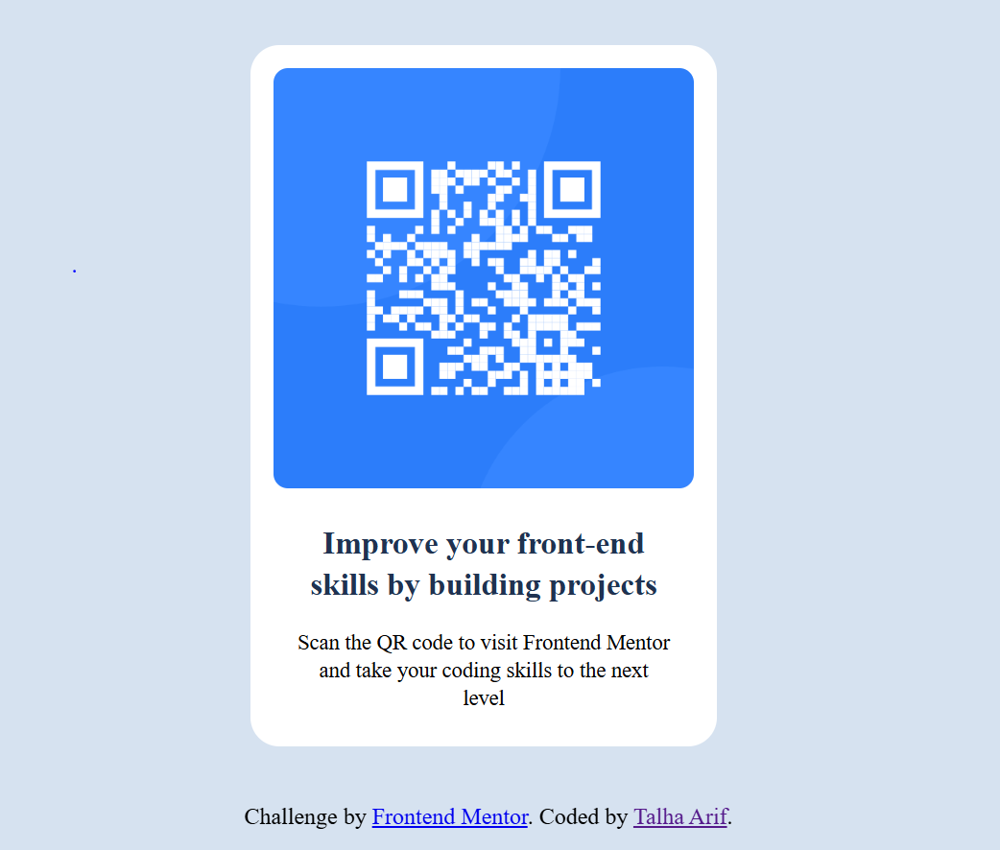

# QR Code Component

This is my first project with Frontend Mentor — a **QR Code Component** built using only **HTML and CSS (Flexbox)**.  
It helped me practice layout, spacing, and component styling in a real-world example.

---

## 📸 Screenshot



---

## 🔗 Live Demo
[Click here to view on GitHub Pages](https://username.github.io/qr-code-component-main/)

---

## 🛠️ Built With
- Semantic **HTML5**  
- **CSS3**  
- **Flexbox** for layout and alignment  

---

## 📚 What I Learned
- How to center a card perfectly with Flexbox  
- Working with `box-shadow`, `border-radius`, and spacing  
- Creating a simple responsive-friendly layout  

```css
.container {
  display: flex;
  justify-content: center;
  align-items: center;
  height: 100vh;
}
